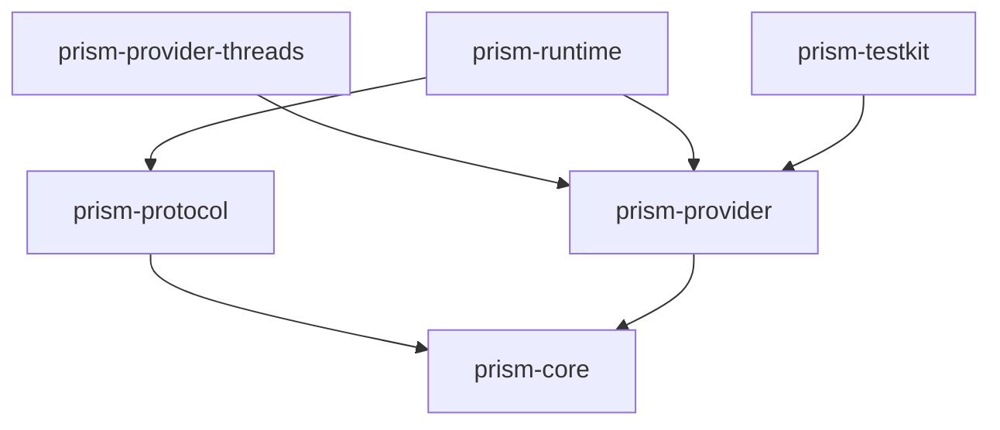

# Architecture

## Purpose

Prism owns deterministic publishing semantics and the contracts used to invoke them. It does not own accounts, workspaces, scheduling, persistence, deployment, provider credentials, client UI, or content generation.

Four rules shape the design:

1. direct stateless execution stays valid;
2. content variants are explicit and no language is canonical;
3. provider-specific behavior stays behind adapter contracts;
4. external actions are observable, idempotency-aware, and never implicit.

All implementations follow the normative SOLID and object-oriented rules in [`engineering-principles.md`](engineering-principles.md).

## Dependency direction

`prism-core` has no network, storage, process, client, HQBase, or ai dependency. Runtime depends on contracts; contracts never depend on runtime implementation.

## Canonical concepts

- `ContentVariant` — one explicit representation of a publication intent. Locale, voice profile, audience, provider target, format, body, and provenance stay independent.
- `PublishTarget` — one provider destination plus explicit variant selection. Credentials are opaque references.
- `ProviderCapabilities` — the provider adapter's current formats, media kinds, and limits.
- `PublishRequest` — variants, targets, dispatch policy, and one logical idempotency key.
- `TargetOutcome` — the independent result for one target.
- `ExecutionEvent` — a deterministic sequence-numbered domain event without wall-clock time.

See [`content-variants.md`](content-variants.md) for the human-facing content model.

## Two-phase execution

Prism completes preflight for every target before it publishes any target.

| Policy | Behavior |
| --- | --- |
| `require_all_valid` | If any target fails preflight, Prism performs no external action. Valid targets become `skipped`. |
| `independent` | Every valid target is attempted. Invalid or failed targets stay isolated in their own outcomes. |

Prism does not promise cross-provider atomicity. External providers cannot join one shared transaction.

## Determinism boundary

Given the same request, capability snapshots, and adapter responses, Prism returns the same variant selections, outcome order, error classes, and event sequence.

Provider latency, upstream state, and external IDs are observations outside that deterministic boundary. Output order still follows target order if future runtime execution becomes concurrent.

## Provider boundary

A provider adapter owns:

- provider HTTP and OAuth behavior;
- credential resolution through an injected boundary;
- provider-native validation and error mapping;
- native idempotency behavior and safe receipt extraction;
- upstream-response redaction.

Core owns only provider-neutral capabilities and stable error classes. Provider-specific fields stay namespaced until the concept proves shared across providers.

`outcome_unknown` means an external action may already have succeeded. The caller must reconcile provider state before retry.

The first real adapter is `prism-provider-threads`. See [`providers/threads.md`](providers/threads.md).

## Protocol boundary

`prism-execution.v1` is independent from crate and binary versions. The current transport is JSON or NDJSON over a local process:

- stdin receives protocol envelopes;
- stdout emits protocol envelopes only;
- stderr carries diagnostics;
- malformed input is reported without echoing the source payload.

A future transport may change without changing publishing semantics.

See [`status.md`](status.md) for the exact implemented/planned boundary.

<!-- © 2026 aiaiaiai · aiaiaiai.org -->
