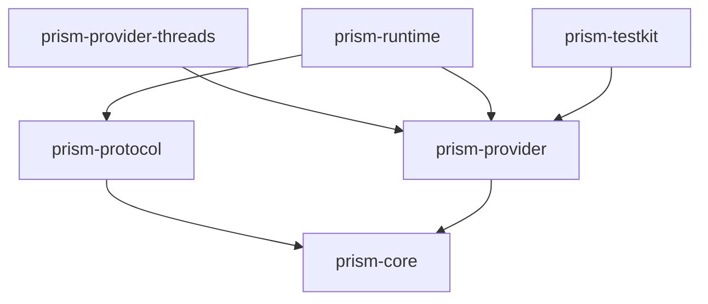
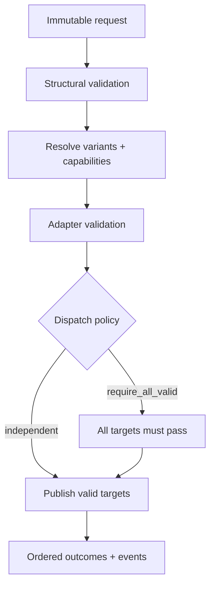

# Architecture

## Purpose

Prism owns deterministic delivery semantics and the public contracts required
to invoke them. It does not own people, workspaces, scheduling, persistence,
deployment, provider credentials, client UX, or content generation.

The design optimizes for four properties:

1. a direct, stateless mode is always valid;
2. localization is explicit and has no canonical intermediate language;
3. provider-specific truth stays behind capability and adapter contracts;
4. an external action is observable, idempotency-aware, and never implicit.

## Dependency direction

`prism-core` has no network, storage, process, client, HQBase, or AI dependency.
The runtime depends inward on contracts; the contracts never depend on runtime
implementation.

## Canonical concepts

- `ContentVariant` is an explicit, immutable delivery candidate. Locale,
  audience, voice profile, and provider targeting are independent dimensions.
- `PublishTarget` identifies a provider channel and an ordered variant
  selection. Credentials are opaque references.
- `ProviderCapabilities` is a runtime snapshot of formats, media kinds, and
  limits. It is data and may change without a Prism release.
- `PublishRequest` combines variants and targets with a dispatch policy and an
  idempotency key.
- `TargetOutcome` records one independent target result. A provider failure does
  not erase results for other targets.
- `ExecutionEvent` is deterministic and sequence-numbered. It contains no wall
  clock time; operational timestamps belong to observability infrastructure.

## Two-phase execution

No target is published before preflight completes for every target. This makes
`require_all_valid` meaningful and ensures unsupported features fail before an
external action whenever Prism can determine that locally.

The policies are explicit:

| Policy | Behavior |
| --- | --- |
| `require_all_valid` | If any target fails preflight, Prism performs no external action. Valid targets become `skipped`. |
| `independent` | Every valid target is attempted; invalid or failed targets remain isolated in their own outcomes. |

Prism does not promise cross-provider atomicity. Once dispatch begins, external
systems cannot participate in one transaction.

## Determinism boundary

Given the same request, capability snapshots, and adapter responses, Prism emits
the same selected variants, outcome order, error classes, and domain event
sequence. Provider latency, generated external IDs, and upstream state are
observations, not deterministic inputs.

Output ordering always follows target order, even if a future runtime executes
provider calls concurrently.

## Provider boundary

An adapter owns:

- provider HTTP and OAuth behavior;
- credential resolution through an injected mechanism;
- provider-native validation and error mapping;
- upstream idempotency support and safe receipt extraction;
- redaction of upstream responses.

The first implementation is `prism-provider-threads`. It resolves opaque
channel and credential references through an injected boundary, keeps the token
out of provider-neutral values and debug output, and uses an injected transport
so required CI can prove behavior without live calls.

An adapter must distinguish a failure that is safe to retry from an ambiguous
external-action outcome. `outcome_unknown` means the action may already have
succeeded; the caller must reconcile provider state before another attempt.

Core owns only provider-neutral capabilities and stable error classes. A new
provider feature first uses a namespaced extension. It becomes canonical only
after the concept proves genuinely shared.

## Protocol boundary

`prism-execution.v1` is independent from crate and binary versions. The initial
transport is JSON or NDJSON over a local process:

- stdin contains protocol envelopes;
- stdout contains protocol envelopes only;
- diagnostics use stderr;
- malformed input is reported without echoing source payloads.

The transport may later become a daemon, Unix socket, or internal HTTP service
without changing execution semantics.

For the exact boundary between implemented and planned behavior, see
[`status.md`](status.md).

<!-- © 2026 aiaiaiai · aiaiaiai.org -->
