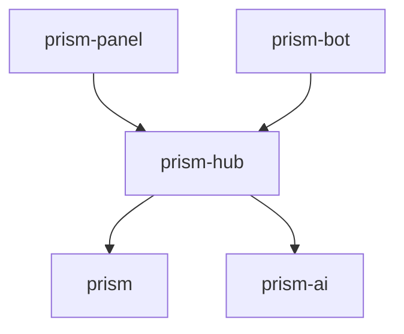

# Engineering principles

This document is normative across the Prism ecosystem. A change that violates these rules is not ready to merge, even when tests pass.

## Current scope

- `prism` — deterministic publishing engine and provider adapters;
- `prism-hub` — control plane and client-facing backend;
- `prism-ai` — optional content-variant producer behind a hub-owned port;
- `prism-bot` — messaging clients that consume the hub API;
- `prism-panel` — planned web administration client.

Native panel applications, including `prism-panel-ios`, are outside the current scope. Current repositories must not add speculative native-client abstractions or dependencies.

## SOLID and object-oriented design

SOLID and object-oriented design are ecosystem invariants. Each language applies them in its own idioms.

- **Single responsibility** — one cohesive role and one principal reason to change.
- **Open/closed** — add providers, channels, ai implementations, or transports behind contracts, not central switches.
- **Liskov substitution** — every implementation preserves the behavior, validation, failure, and security guarantees of its contract.
- **Interface segregation** — consumers depend only on focused capabilities they use.
- **Dependency inversion** — domain and application policy depend on ports, never frameworks, databases, transports, provider SDKs, or ai vendors.

Prefer composition over inheritance, explicit dependency injection over service location, and immutable value objects over unstructured maps. Hidden dependencies and global mutable state are prohibited.

Pure functions are welcome when they support clear ownership and encapsulation.

## Architecture by repository

| Repository | Required architecture | Object model |
| --- | --- | --- |
| `prism` | Hexagonal architecture | Rust structs/enums as entities and values, traits as focused ports, adapters, explicit composition |
| `prism-hub` | Clean Architecture | Entities, values, use cases, focused ports, persistence adapters, framework adapters |
| `prism-ai` | Ports and adapters | Generation specifications, strategies, model ports, policy objects, provenance-bearing results |
| `prism-bot` | Modular monolith with Clean Architecture per channel | Channel-independent use cases plus messaging adapters |
| `prism-panel` | Feature-oriented frontend with Clean Architecture boundaries | Presentation state isolated from generated hub clients and auth adapters |

MVVM may organize presentation state where it helps. VIPER is not part of the current ecosystem contract.

## Dependency invariant

- Clients know only the versioned `prism-hub` API.
- `prism-hub` publishes through Prism and may request generation through `prism-ai`.
- Prism and `prism-ai` do not know about the hub or clients.
- Provider credentials remain server-side and never enter clients.

## Review gate

Every material pull request must answer:

1. Which object or module owns the behavior?
2. Which focused contract separates policy from infrastructure?
3. Can implementations be substituted without weakening behavior or security?
4. Does extension avoid a central provider, channel, or vendor switch?
5. Are dependencies explicit and directed inward?
6. Do unit and contract tests prove the boundary without external services?

<!-- © 2026 aiaiaiai · aiaiaiai.org -->
