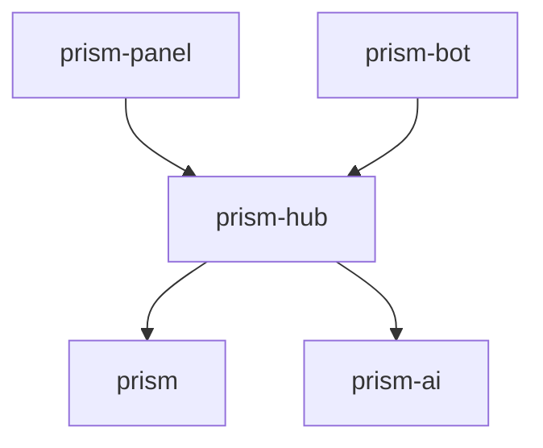

# Engineering principles

This document is normative for every repository in the Prism ecosystem. A
change that violates these rules is not ready to merge, even when its tests
pass.

## Current product scope

The active ecosystem consists of:

- `prism`, the deterministic publishing engine and provider adapters;
- `prism-hub`, the control plane and sole client-facing backend;
- `prism-ai`, an optional content-variant producer invoked through hub-owned
  use cases;
- `prism-bot`, modular bot and messaging surfaces that consume the hub API;
- `prism-panel`, the planned web administration client for configuring and
  operating multiple installations through the hub API.

Native panel applications, including `prism-panel-ios`, are explicitly outside
the current scope. Current repositories must not add iOS-specific abstractions,
dependencies, delivery plans, or speculative compatibility layers. A separate
architecture decision is required before that scope can be introduced.

## SOLID and object-oriented design

SOLID and object-oriented design are ecosystem invariants. They apply in the
idioms of each implementation language rather than requiring every language to
imitate class-based inheritance.

- **Single responsibility:** a type or module has one cohesive role and one
  principal reason to change. Controllers, jobs, adapters, and models must not
  accumulate unrelated application policy.
- **Open/closed:** new providers, channels, AI implementations, transports, or
  client modules are added behind contracts. Extension must not require a
  growing central type switch.
- **Liskov substitution:** every implementation preserves the behavioral,
  validation, failure, and security guarantees of its contract. A fake or
  alternate adapter must be safely substitutable for the production one.
- **Interface segregation:** consumers depend only on focused capabilities they
  use. Broad service objects and catch-all interfaces are prohibited.
- **Dependency inversion:** domain and application policy depend on ports,
  never concrete frameworks, databases, transports, provider SDKs, or AI
  vendors. Implementations are supplied explicitly at composition roots.

Behavior and state belong in cohesive objects, components, or modules. Prefer
composition over inheritance, explicit dependency injection over service
location, and immutable value objects over unstructured maps. Global mutable
state and hidden dependencies are prohibited.

Pure functions remain welcome inside domain objects and modules when they make
behavior easier to reason about. They complement the object model; they do not
replace explicit ownership, encapsulation, or dependency boundaries.

## Architectural patterns by repository

| Repository | Required architecture | Object model |
| --- | --- | --- |
| `prism` | Hexagonal architecture with an object-oriented domain model | Rust structs and enums as entities/value objects; traits as focused ports; adapters and an explicit composition root |
| `prism-hub` | Clean Architecture with domain, application, interface, and infrastructure boundaries | Entities/value objects, use-case objects, ports, repositories only where an aggregate needs persistence abstraction, and framework adapters |
| `prism-ai` | Internal service using ports and adapters around model-independent generation use cases | Prompt/specification value objects, generation strategies, provider ports, policy objects, and provenance-bearing results |
| `prism-bot` | Modular monolith with Clean Architecture per channel module | Channel-independent use cases plus Telegram, WhatsApp, Viber, and future surface adapters; no provider or hub policy duplicated in handlers |
| `prism-panel` | Feature-oriented frontend using Clean Architecture boundaries; MVVM only where presentation state benefits from it | View models/presenters isolate UI state; generated hub API clients and auth adapters remain outside the domain; views contain no application policy |

VIPER is not a current ecosystem invariant. It is optimized for native UI
modules and would add ceremony without clarifying the present Rust, Rails, bot,
or web boundaries. If a native client is deliberately introduced later, its
presentation architecture must be decided for that repository without changing
the ecosystem dependency direction.

## Repository dependency invariant

- Clients know only the versioned `prism-hub` API, never `prism`, provider
  APIs, or `prism-ai` directly.
- `prism-hub` orchestrates publishing through `prism` and optional generation
  through `prism-ai` ports.
- `prism` and `prism-ai` do not know about the hub or clients.
- Provider credentials remain server-side and never enter bot or panel clients.

## Review gate

Every material pull request must answer:

1. Which object or module owns the new behavior?
2. Which focused contract separates policy from infrastructure?
3. Can its implementation be substituted without weakening behavior or
   security?
4. Does the change extend the system without adding a central provider,
   channel, or vendor switch?
5. Are dependencies supplied explicitly and directed inward?
6. Do contract and unit tests prove the boundary independently of frameworks
   and external services?

<!-- © 2026 aiaiaiai · aiaiaiai.org -->
